# Flask App - OpenClassrooms Project 11
**Improve a web Flask app by testing and debugging**

---

## DESCRIPTION

This project was completed as part of the "Python Developer" path at OpenClassrooms.

The goal was to improve a web application, through testing and debugging, capable of:

- managing lifting competitions
- allowing clubs to authenticate themselves within the application
- allowing clubs to reserve places in several lifting competitions

The application must:

- allow the club secretary to log in.
- allow the club secretary to view competitions and other clubs' points.
- allow the club secretary to use their points to purchase competition tickets.
- display error messages in case of incorrect action, according to the application specifications.

---

## PROJECT STRUCTURE
<p align="center">
    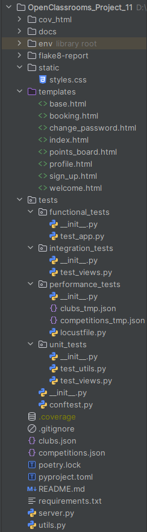
</p>

---

## INSTALLATION

- ### Clone the repository :

```
git clone https://github.com/Tit-Co/OpenClassrooms_Project_11.git
```

- ### Navigate into the project directory :
    `cd OpenClassrooms_Project_11`

- ### Create a virtual environment and dependencies :

1. #### With [uv](https://docs.astral.sh/uv/)

    `uv` is an environment and dependencies manager.
    
    - #### Install environment and dependencies
    
    `uv sync`

2. #### With pip

   - #### Install the virtual env :

    `python -m venv env`

   - #### Activate the virtual env :
    `source env/bin/activate`  
    Or  
    `env\Scripts\activate` on Windows  

3. #### With [Poetry](https://python-poetry.org/docs/)

    `Poetry` is a tool for dependency management and packaging in Python.
    
    - #### Install the virtual env :
    `py -3.13 -m venv env`
    
    - #### Activate the virtual env :
    `poetry env activate`

- ### Install dependencies 
  1. #### With [uv](https://docs.astral.sh/uv/)
      `uv sync` or `uv pip install -r requirements.txt`

  2. #### With pip
      `pip install -r requirements.txt` 

  3. #### With [Poetry](https://python-poetry.org/docs/)
      `poetry install`
  
     (NB : Poetry and uv will read the `pyproject.toml` file to know which dependencies to install)

---

## USAGE

### Launching server
- Open a terminal
- Go to project folder - example : `cd gudlft`
- Activate the virtual environment as described previously
- Create flask environment : `$env:FLASK_APP = "server"` (for example in Powershell)
- Launch the Django server : `flask run`

### Launching the APP
- Open a web browser
- And type the URL : `http://127.0.0.1:5000/`

---

## ISSUES THAT HAS BEEN FIXED

- A user types in an email not found in the system
- The club should not be able to redeem more points than available
- The club should be able to book no more than 12 places
- The club should not be able to book a place on a post-dated competition (but past competitions should be visible). 
- The amount of points used should be deducted from the club's balance
- The club should be able to see the list of clubs and their associated current points balance
- The club should not be able to book more than the competition places available

---

## EXPLANATIONS OF WHAT THE APP DOES

### <u>Registration</u>
- The user can sign in the application by typing the club name, email and password (two times).

### <u>Authentication</u>
- The user can log in the application by typing the club email and password.

### <u>Profile page</u>
- The user can see the club profile by clicking on "go to profile" link in welcome page.

### <u>Welcome page</u>
- The user can view all past and upcoming competitions, and access the booking page by clicking on the competition they
wish to participate in.

### <u>Booking page</u>
- The user can book places in the competition by typing the number of places. The UI will display a message according 
to the validation or rejection of the entry.

### <u>Log out</u>
- The user can log out by clicking the appropriate link.

### <u>Points board</u>
- The user can view the points board with all the clubs and their points. 
- No need to be authenticated to see this board.

---

## TEMPLATES EXAMPLES

- Registration
<p align="center">
    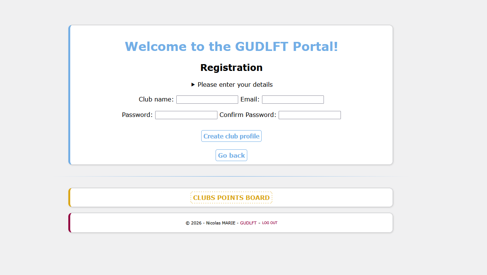
</p>

- Authentication
<p align="center">
    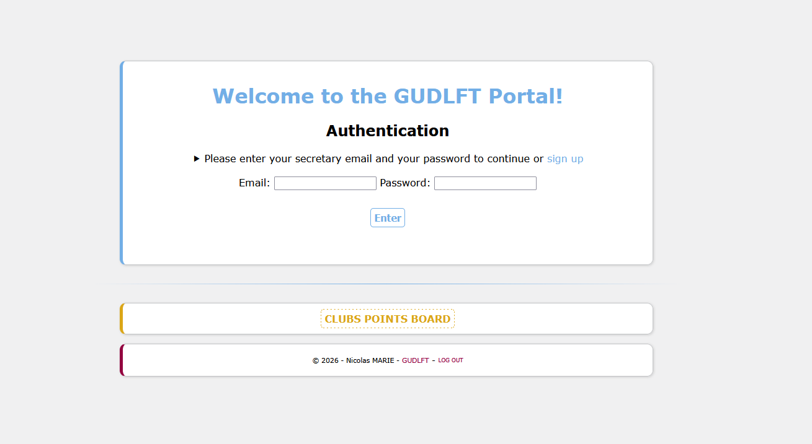
</p>

- Profile page
<p align="center">
    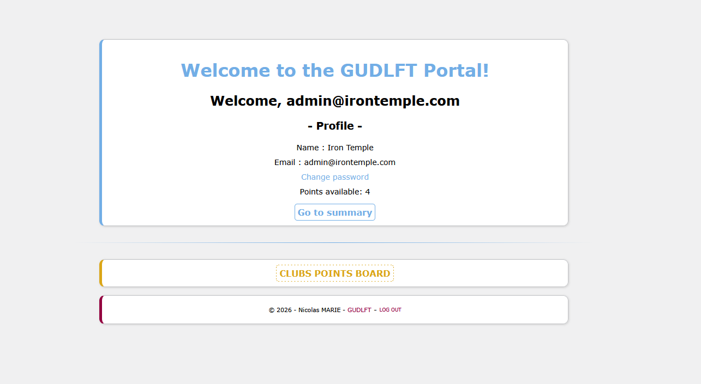
</p>

- Change password
<p align="center">
    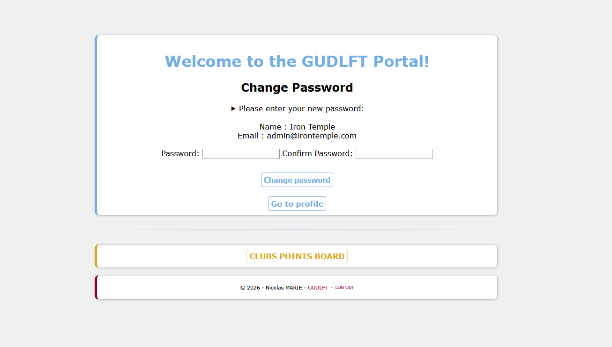
</p>

- Points board
<p align="center">
    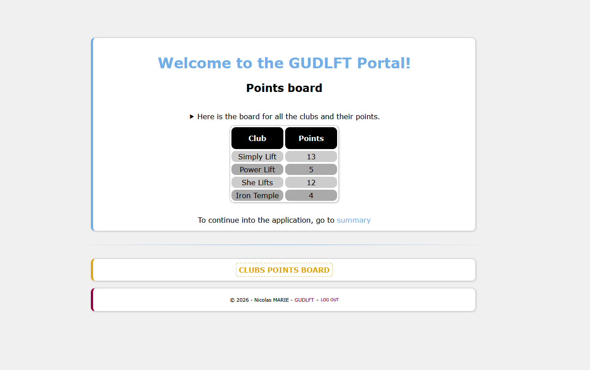
</p>

- Welcome page
<p align="center">
    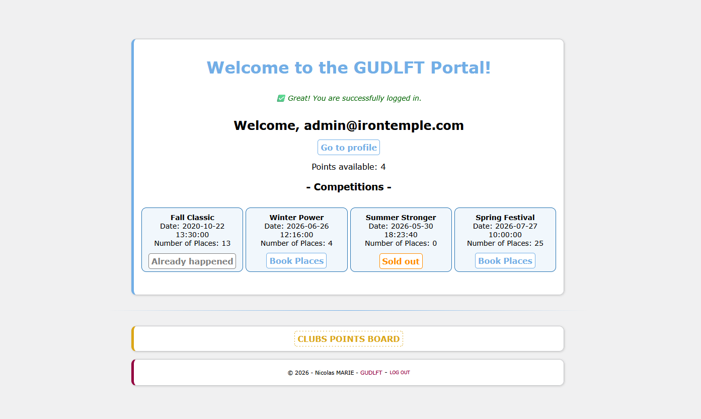
</p>

- Booking page
<p align="center">
    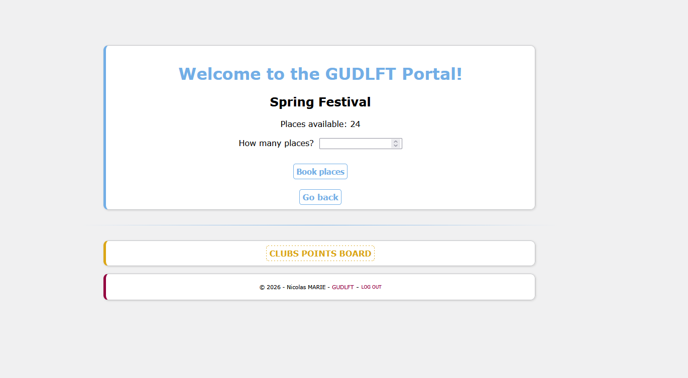
</p>

- Log out
<p align="center">
    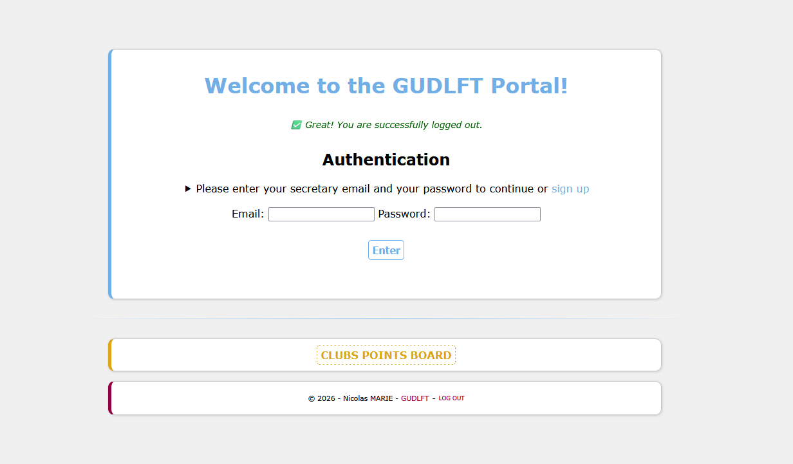
</p>

---
## PEP 8 CONVENTIONS

- Flake 8 report (yet to come)
<p align="center">
    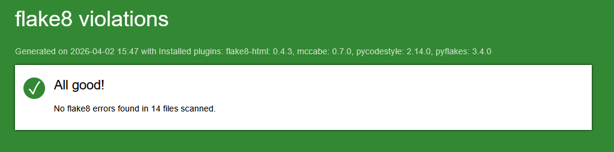
</p>

**Type the line below in the terminal to generate another report with [flake8-html](https://pypi.org/project/flake8-html/) tool :**

` flake8 --format=html --htmldir=flake8-report --max-line-length=119 --extend-exclude=env/`

---

## TESTS COVERAGE WITH PYTEST

Cov report
<p align="center">
    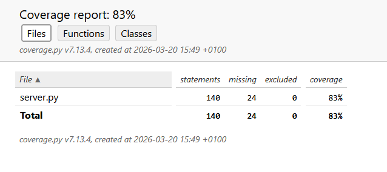
    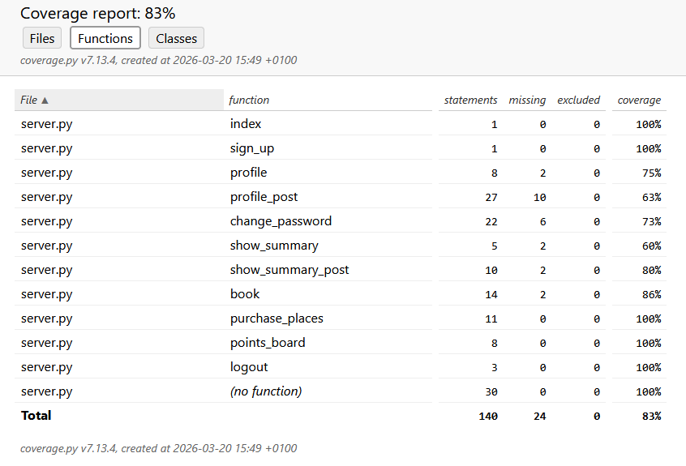
</p>

- **Type the line below in the terminal to generate another coverage report with pytest**

    `pytest --cov=server --cov-report=html:<name-of-report-folder>`

---

## PERFORMANCE TESTS WITH LOCUST

Locust report (yet to come)
<p align="center">
    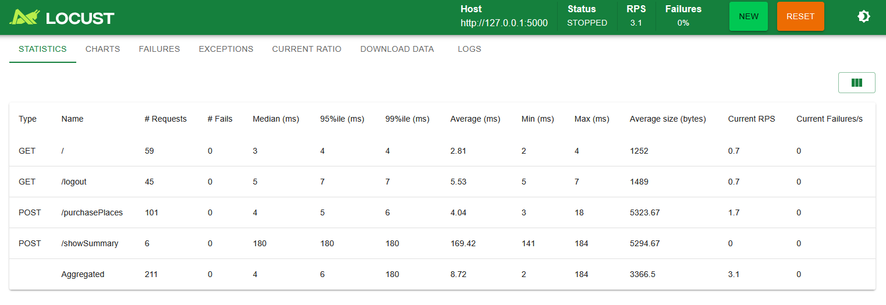
</p>

- **Launch the application as described previously**

- **Open another terminal, activate the virtual env, and type the `locust` command to launch the performance tests**

---


---

## AUTHOR
**Name**: Nicolas MARIE  
**Track**: Python Developer – OpenClassrooms  
**Project 11 – Improve a Flask web app by testing and debugging – March 2025**
